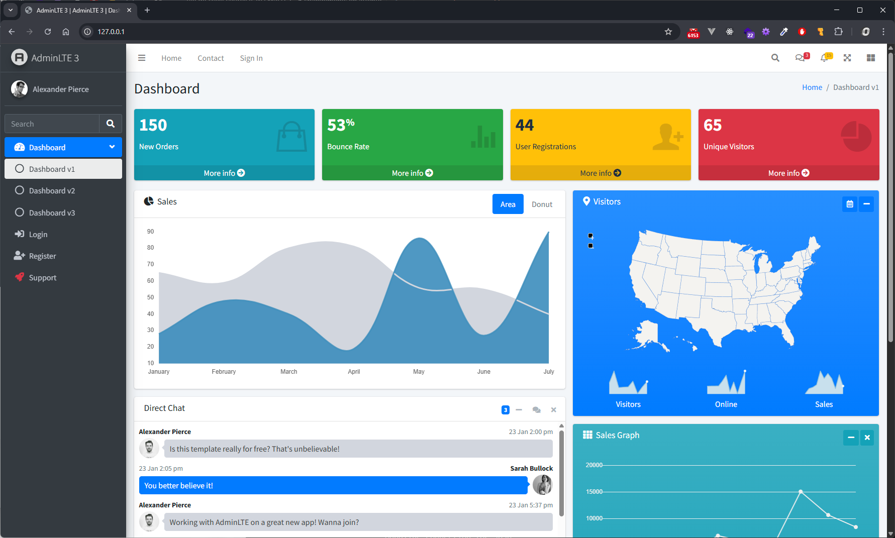
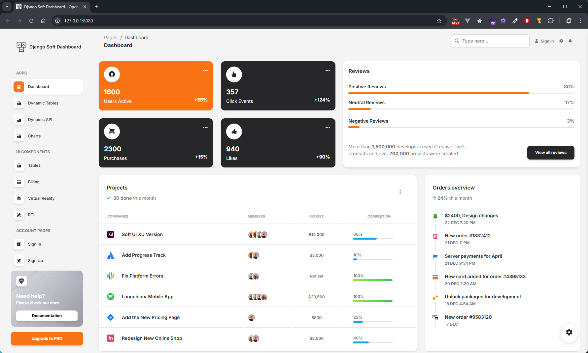
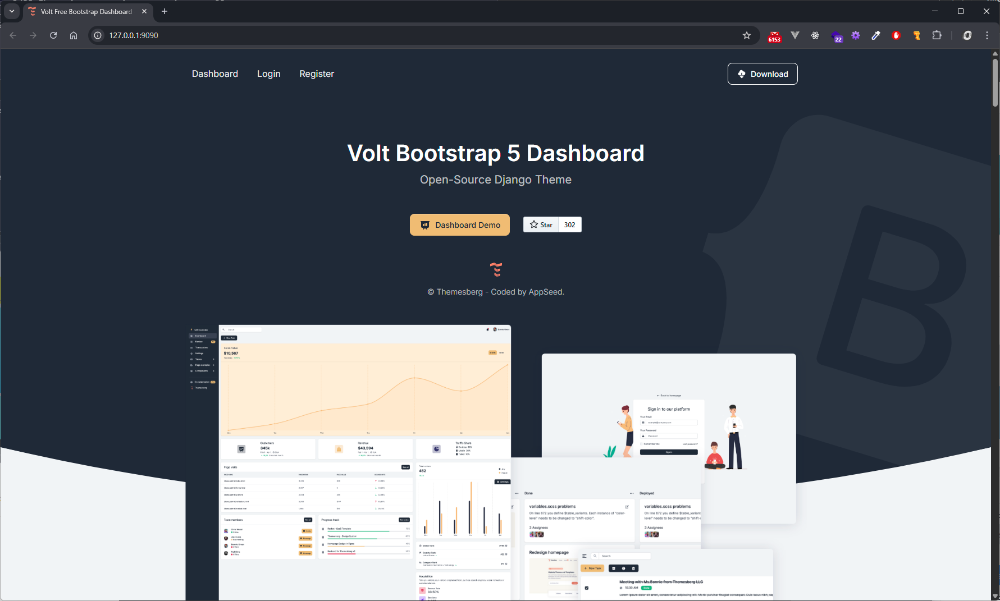
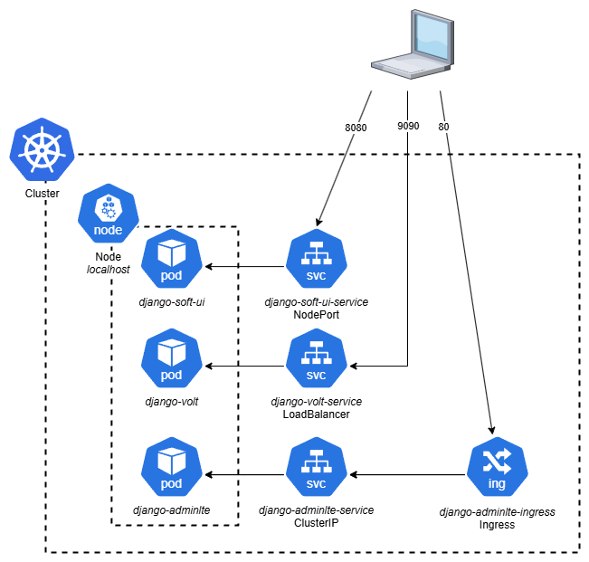

# 📦 Projet DevSecOps – Kubernetes E5

## 👨‍💻 Contexte

Dans le cadre de notre mission en tant qu’ingénieur SRE, notre scrum master nous a confié la réalisation d’une **maquette Kubernetes** pour un client souhaitant tester la faisabilité d’une migration vers cette technologie.

Le client dispose de **trois applications web**, dont une critique en **Django**, à exposer respectivement sur les ports **80**, **8080** et **9090**. Les applications utilisent des fichiers d’environnement, et doivent être déployées dans un cluster Kubernetes avec des **manifests séparés pour chaque composant**.

---

## 🎯 Objectifs

- Containeriser les 3 applications avec **Docker**, en optimisant les images.
- Déployer 3 applications dans **Kubernetes** avec :
  - Un **Deployment**
  - Un **Service**
  - Au moins un **Ingress**
- Séparer chaque composant dans un **manifeste distinct**.
- Permettre un **accès externe** aux applications.
- Documenter le projet dans un **repo Git** avec :
  - Code source des apps
  - Dockerfiles
  - Manifests Kubernetes
  - Diagramme d’architecture
    
---

## 🛠️ Étapes de réalisation

### 1. Création des applications

- **App Django AdminLte (port 80)** 
- **App Django SoftUi (port 8080)** 
- **App Django Volt (port 9090)**

Chaque application sera accompagnée d’un **Dockerfile** optimisé.

---

### 2. Création des images Docker

- Clone des projets depuis Github
- Rédaction de docker ignore et optimisation du dockerfile pour gagner de l'espace
- Construction locale avec `docker build`.
- Dépôt des images dans un registre Docker local.

**Clone des projets Git:**
On commance par récupérer les projets via la commande git clone:
```bash
gd@ubuntu-server:~$ git clone https://github.com/app-generator/django-volt-1744777679.git
Cloning into 'django-volt-1744777679'...
remote: Enumerating objects: 102, done.
remote: Counting objects: 100% (102/102), done.
remote: Compressing objects: 100% (94/94), done.
remote: Total 102 (delta 52), reused 0 (delta 0), pack-reused 0 (from 0)
Receiving objects: 100% (102/102), 13.49 KiB | 2.25 MiB/s, done.
Resolving deltas: 100% (52/52), done.
```
**Rédaction d'un docker ignore**
Rédaction d'un docker ignore afin d'optimiser l'image docker le plus possible en enlevant les fichiers inutiles
```
.git
__pycache__
*.pyc
*.pyo
*.pyd
./nginx
*.sh
*.md
docker-compose.yml
Dockerfile
render.yaml
.gitignore
.dockerignore
```

**Modification du dockerfile**
On va maintenant continuer l'optimisation de l'image en modifiant le dockerfile. Nous allons modifier l'image Python utilisée par une image alpine de celui-ci qui est beaucoup plus légère :

*Avant modification :* 
```docker
FROM python:3.9

# set environment variables
ENV PYTHONDONTWRITEBYTECODE=1
ENV PYTHONUNBUFFERED=1

COPY requirements.txt .
# install python dependencies
RUN pip install --upgrade pip
RUN pip install --no-cache-dir -r requirements.txt

COPY . .

# running migrations
RUN python manage.py migrate

# gunicorn
CMD ["gunicorn", "--config", "gunicorn-cfg.py", "config.wsgi"]
```

*Après modification :*
```docker
FROM python:3.9-alpine

ENV PYTHONDONTWRITEBYTECODE=1
ENV PYTHONUNBUFFERED=1

COPY requirements.txt .

RUN pip install --upgrade pip
RUN pip install --no-cache-dir -r requirements.txt

COPY . .

RUN python manage.py migrate

CMD ["gunicorn", "--config", "gunicorn-cfg.py", "config.wsgi"]
```

**Build image docker**

On va maintenant passer au build des images docker qui seront stockées dans le registre local (localhost/) grâce à la commande docker build : 

```bash
docker build ./django-volt -t localhost/django-volt:latest
[+] Building 37.5s (13/13) FINISHED                                                                                                                                                                                docker:default
 => [internal] load build definition from Dockerfile                                                                                                                                                                         0.1s
 => => transferring dockerfile: 419B                                                                                                                                                                                         0.0s
 => [internal] load metadata for docker.io/library/python:3.9-alpine                                                                                                                                                         1.6s
 => [internal] load .dockerignore                                                                                                                                                                                            0.1s
 => => transferring context: 159B                                                                                                                                                                                            0.0s
 => [1/8] FROM docker.io/library/python:3.9-alpine@sha256:c549d512f8a56f7dbf15032c0b21799f022118d4b72542b8d85e2eae350cfcd7                                                                                                   7.4s
 => => resolve docker.io/library/python:3.9-alpine@sha256:c549d512f8a56f7dbf15032c0b21799f022118d4b72542b8d85e2eae350cfcd7                                                                                                   0.1s
 => => sha256:c549d512f8a56f7dbf15032c0b21799f022118d4b72542b8d85e2eae350cfcd7 10.29kB / 10.29kB                                                                                                                             0.0s
 => => sha256:920c6d2e0859e15c81b84b28964b7a47771d593f1bbcc0d993fbf39c6f8b050f 1.73kB / 1.73kB                                                                                                                               0.0s
 => => sha256:3f2234415a3570fc933cd711b6baf7b905d0c6367cf747af84dbf9fbee642b10 5.08kB / 5.08kB                                                                                                                               0.0s
 => => sha256:f18232174bc91741fdf3da96d85011092101a032a93a388b79e99e69c2d5c870 3.64MB / 3.64MB                                                                                                                               0.6s
 => => sha256:31050cb47a0204aa139821ee500ed6b13dc7142d89b12154f9a2d2efba8a6ab7 460.18kB / 460.18kB                                                                                                                           0.5s
 => => sha256:374b62c84664db7f5059aa54735d1e7921d3350b69515a1c9651201795807c3d 14.87MB / 14.87MB                                                                                                                             1.4s
 => => extracting sha256:f18232174bc91741fdf3da96d85011092101a032a93a388b79e99e69c2d5c870                                                                                                                                    1.0s
 => => sha256:4facdbdcc8a37a46035340540047c8eed35e9b8dfd033632e0438d03f82d021a 250B / 250B                                                                                                                                   0.8s
 => => extracting sha256:31050cb47a0204aa139821ee500ed6b13dc7142d89b12154f9a2d2efba8a6ab7                                                                                                                                    0.6s
 => => extracting sha256:374b62c84664db7f5059aa54735d1e7921d3350b69515a1c9651201795807c3d                                                                                                                                    3.8s
 => => extracting sha256:4facdbdcc8a37a46035340540047c8eed35e9b8dfd033632e0438d03f82d021a                                                                                                                                    0.0s
 => [internal] load build context                                                                                                                                                                                            0.2s
 => => transferring context: 10.96kB                                                                                                                                                                                         0.0s
 => [2/8] COPY requirements.txt .                                                                                                                                                                                            0.4s
 => [3/8] RUN pip install --upgrade pip                                                                                                                                                                                      6.3s
 => [4/8] RUN pip install --no-cache-dir -r requirements.txt                                                                                                                                                                12.1s
 => [5/8] COPY . .                                                                                                                                                                                                           0.2s
 => [6/8] RUN python manage.py collectstatic --no-input                                                                                                                                                                      2.4s
 => [7/8] RUN python manage.py makemigrations                                                                                                                                                                                2.1s
 => [8/8] RUN python manage.py migrate                                                                                                                                                                                       3.0s
 => exporting to image                                                                                                                                                                                                       1.5s
 => => exporting layers                                                                                                                                                                                                      1.5s
 => => writing image sha256:aeb2681e21a410e9a52e7b4806d05a91a81115223e8b8cce2c4a19f2cc11c2e3                                                                                                                                 0.0s
 => => naming to localhost/django-volt:latest
```

On répète cette opération pour chacune des applications.

---

### 3. Déploiement Kubernetes

Pour chaque app, les composants suivants sont créés :

- **Deployment** : gère la réplication et le redémarrage automatique des pods.
- **Service** : expose les pods à l’intérieur du cluster.
- **Ingress** : définit les règles de routage HTTP externe.

Un **Ingress Controller** est également déployé pour gérer l’entrée HTTP du cluster.

Avant toute chose, on commence par charger les images précédemment créées dans Minikube. (On ajoute le build au repo local, d'où le localhost au début du nom pour préciser son emplacement).
```bash
gd@ubuntu-server:~$ minikube image load localhost/django-volt:latest
```

Une fois les images chargé on vérifie qu'elles sont bien chargées dans le minikube :
```bash
gd@ubuntu-server:~$ minikube image ls
...
localhost/django-volt:latest
localhost/django-soft-ui:latest
localhost/django-adminlte:latest
...
```
#### Rédaction des manifests

**Deployment Manifest**

Ce manifest sert a déployé l'application nommée django admin-lte avec un seul pod, elle utilise une image docker et expose le port 5005

```yml
apiVersion: apps/v1
kind: Deployment
metadata:
  name: django-adminlte-deployment
spec:
  replicas: 1
  selector:
    matchLabels:
      app: django-adminlte
  template:
    metadata:
      labels:
        app: django-adminlte
    spec:
      containers:
        - name: django-adminlte
          imagePullPolicy: Never
          image: localhost/django-adminlte:latest
          ports:
            - containerPort: 5005
```

On refait quelque chose de similaire pour les deux autres applications, la seule différence va être l'image utilisée ainsi que le nom de l'application.

**Service Manifest**

##### AdminLte

Ce service expose l’application django-adminlte sur le port 5005 en interne, ce qui permet aux autres composants du cluster de communiquer avec elle.

```yml
apiVersion: v1
kind: Service
metadata:
  name: django-adminlte-service
spec:
  selector:
    app: django-adminlte
  ports:
  - port: 5005
```

##### SoftUi

Ce service de type NodePort rend l’application django-soft-ui accessible depuis l’extérieur du cluster via le port 30001 du nœud, en redirigeant vers le port 5005 du conteneur.

```yml
apiVersion: v1
kind: Service
metadata:
  name: django-soft-ui-service
spec:
  type: NodePort
  selector:
    app: django-soft-ui
  ports:
  - port: 5005
    targetPort: 5005
    nodePort: 30001
```

##### Volt

Ce service de type LoadBalancer permet d’exposer l’application django-volt à l’extérieur du cluster avec une IP publique (si prise en charge) et un accès via le port 30002, mappé au port 5005 de l’application.

```yml
apiVersion: v1
kind: Service
metadata:
  name: django-volt-service
spec:
  type: LoadBalancer
  selector:
    app: django-volt
  ports:
  - port: 5005
    targetPort: 5005
    nodePort: 30002
```

**Ingress Manifest**

Ce manifeste définit une ressource Ingress qui redirige le trafic HTTP entrant sur le chemin / vers le service django-adminlte-service sur le port 5005, en utilisant un contrôleur Ingress pour gérer l'accès depuis l'extérieur via une URL conviviale.

```yml
apiVersion: networking.k8s.io/v1
kind: Ingress
metadata:
  name: django-adminlte-ingress
  annotations:
    nginx.ingress.kubernetes.io/rewrite-target: /
spec:
  rules:
    - http:
        paths:
          - path: /
            pathType: Prefix
            backend:
              service:
                name: django-adminlte-service
                port:
                  number: 5005
```

#### Applications des manifests

Cette commande applique tous les manifestes du dossier ./manifests/, ce qui crée les déploiements, services et l’ingress des trois applications Django, rendant ainsi les applications prêtes à être exécutées et accessibles dans le cluster.

```bash
gd@ubuntu-server:~$ k apply -f ./manifests/
deployment.apps/django-adminlte-deployment created
ingress.networking.k8s.io/django-adminlte-ingress created
service/django-adminlte-service created
deployment.apps/django-soft-ui-deployment created
service/django-soft-ui-service created
deployment.apps/django-volt-deployment created
service/django-volt-service created
```

#### Vérification des manifests

Cette commande applique tous les manifestes du dossier ./manifests/, ce qui crée les déploiements, services et l’ingress des trois applications Django, rendant ainsi les applications prêtes à être exécutées et accessibles dans le cluster.

```bash
gd@ubuntu-server:~$ k get all
NAME                                             READY   STATUS    RESTARTS   AGE
pod/django-adminlte-deployment-c9d99c5b-smp77    1/1     Running   0          38s
pod/django-soft-ui-deployment-68d4cc5f9c-77mtm   1/1     Running   0          38s
pod/django-volt-deployment-c65f6bf59-rtrbd       1/1     Running   0          38s

NAME                              TYPE           CLUSTER-IP       EXTERNAL-IP   PORT(S)          AGE
service/django-adminlte-service   ClusterIP      10.101.146.7     <none>        5005/TCP         38s
service/django-soft-ui-service    NodePort       10.101.164.91    <none>        5005:30001/TCP   38s
service/django-volt-service       LoadBalancer   10.106.198.174   <pending>     5005:30002/TCP   38s
service/kubernetes                ClusterIP      10.96.0.1        <none>        443/TCP          42h

NAME                                         READY   UP-TO-DATE   AVAILABLE   AGE
deployment.apps/django-adminlte-deployment   1/1     1            1           38s
deployment.apps/django-soft-ui-deployment    1/1     1            1           38s
deployment.apps/django-volt-deployment       1/1     1            1           38s

NAME                                                   DESIRED   CURRENT   READY   AGE
replicaset.apps/django-adminlte-deployment-c9d99c5b    1         1         1       38s
replicaset.apps/django-soft-ui-deployment-68d4cc5f9c   1         1         1       38s
replicaset.apps/django-volt-deployment-c65f6bf59       1         1         1       38s

gd@ubuntu-server:~$ k get ingress
NAME                      CLASS   HOSTS   ADDRESS        PORTS   AGE
django-adminlte-ingress   nginx   *       192.168.49.2   80      64s
```

#### Port fowarding

Utilisation de la commande k port-forward afin d'accéder aux applications sur les ports souhaités.

```bash
gd@ubuntu-server:~$ k port-forward service/django-soft-ui-service 8080:5005
Forwarding from 127.0.0.1:8080 -> 5005
Forwarding from [::1]:8080 -> 5005
Handling connection for 8080
Handling connection for 8080

gd@ubuntu-server:~$ k port-forward service/django-volt-service 9090:5005
Forwarding from 127.0.0.1:9090 -> 5005
Forwarding from [::1]:9090 -> 5005
Handling connection for 9090
Handling connection for 9090
```

---

### 4. Accès externe

Pour permettre l’accès aux applications depuis l’extérieur du cluster Kubernetes, plusieurs solutions ont été mises en place :

- **Ingress** : Une ressource `Ingress` a été créée pour l’application critique `django-adminlte`, associée à un contrôleur NGINX. Cela permet d’exposer l’application via l’URL du cluster, ici `http://192.168.49.2`, en redirigeant le trafic vers le service interne sur le port 5005.

- **Service NodePort** : L’application `django-soft-ui` est exposée grâce à un service de type `NodePort`, configuré sur le port `30001`. Cela permet un accès externe en utilisant l’adresse IP du nœud et le port défini.

- **Service LoadBalancer** : L’application `django-volt` utilise un service de type `LoadBalancer`, qui, dans un environnement cloud, attribuerait automatiquement une IP publique. En environnement local (comme Minikube), une IP est simulée, en attente de routage externe.

- **Port Forwarding** : En parallèle, des commandes `kubectl port-forward` ont été exécutées pour permettre l’accès direct aux services via le terminal :
  - `django-soft-ui` est accessible localement via [http://localhost:8080](http://localhost:8080)
  - `django-volt` est accessible localement via [http://localhost:9090](http://localhost:9090)

Ces différents modes d’accès permettent de tester et de valider la disponibilité des applications sans nécessiter de configuration réseau complexe en local.

### 5. Applications

Aperçu visuel des applications déployées dans le cluster Kubernetes :

#### Django AdminLte (Critique)



#### Django SoftUi



#### Django Volt



### 6. Architecture

Cette architecture illustre le déploiement de trois applications distinctes dans un cluster Kubernetes. Chaque application dispose de son propre déploiement, service, et éventuellement d’un ingress pour gérer les accès externes. Le LoadBalancer, les NodePort et l’ingress contrôlent l’exposition des applications. Le tout est orchestré par le plan de contrôle Kubernetes, garantissant la haute disponibilité et la scalabilité de l’environnement.

